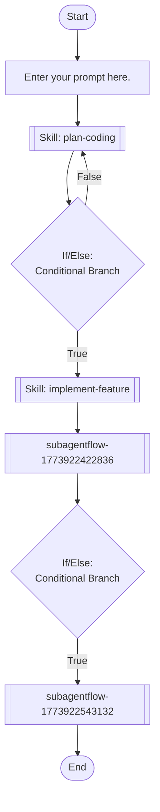

## Workflow Execution Guide

Follow the Mermaid flowchart above to execute the workflow. Each node type has specific execution methods as described below.

### Execution Methods by Node Type

- **Rectangle nodes (Sub-Agent: ...)**: Execute Sub-Agents
- **Diamond nodes (AskUserQuestion:...)**: Use the AskUserQuestion tool to prompt the user and branch based on their response
- **Diamond nodes (Branch/Switch:...)**: Automatically branch based on the results of previous processing (see details section)
- **Rectangle nodes (Prompt nodes)**: Execute the prompts described in the details section below

## Skill Nodes

#### skill_1773922148864(plan-coding)

- **Prompt**: skill "plan-coding"

#### skill_1773922378632(implement-feature)

- **Prompt**: skill "implement-feature"

## Sub-Agent Flow Nodes

#### subagentflow_1773922422836(code-review)

@Sub-Agent: my-workflow_code-review

#### subagentflow_1773922543132(test-features)

@Sub-Agent: my-workflow_test-features

### Prompt Node Details

#### prompt_1773922093034(Enter your prompt here.)

```
Enter your prompt here.

You can use variables like {{variableName}}.
```

### If/Else Node Details

#### ifelse_1773922446153(Binary Branch (True/False))

**Branch conditions:**

- **True**: When condition is true
- **False**: When condition is false

**Execution method**: Evaluate the results of the previous processing and automatically select the appropriate branch based on the conditions above.

#### ifelse_1773922461949(Binary Branch (True/False))

**Branch conditions:**

- **True**: When condition is true
- **False**: When condition is false

**Execution method**: Evaluate the results of the previous processing and automatically select the appropriate branch based on the conditions above.
