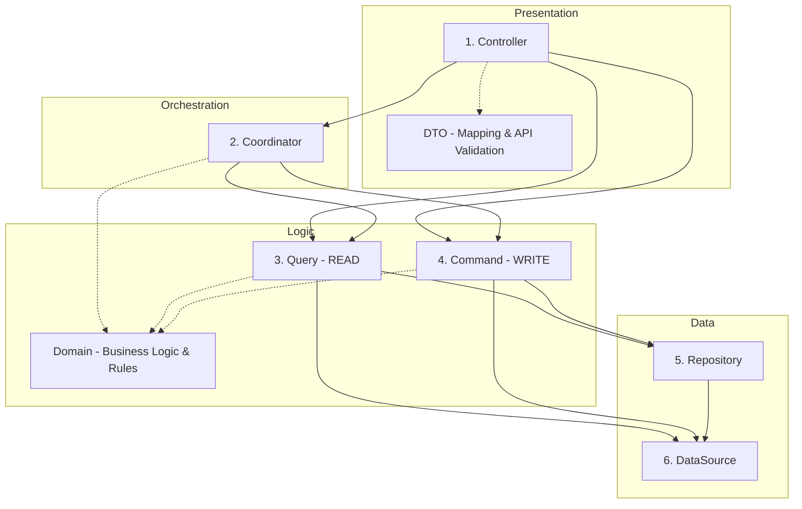

# Lauer Architecture of BE

## Context

To maintain high code quality, reduce the introduction of bugs, and ensure the codebase remains easy to modify as the project grows, we need a clear and consistent backend architectural pattern. This ADR defines the "Lauer" layered architecture, its access rules, and data structures.

## Decision

We adopt a layered architecture with CQRS (Command Query Responsibility Segregation) principles. The architecture is divided into the following layers and data structures:

### Layer Visualization (Mermaid)



### Data Structures & Validation

*   **DTO (Data Transfer Object)**: 
    *   Used in the **Controller** layer.
    *   Responsibilities: Mapping API requests to domain objects and performing initial API-level validation (e.g., required fields, basic formats).
*   **Domain**:
    *   Used in **Coordinator**, **Query**, and **Command** layers.
    *   Responsibilities: Encapsulates all business logic and domain rules (e.g., `User` domain with fields like `id`, `name`, `email`).
    *   **Validation**: Must contain strict business validation logic (e.g., "Name must be between 0 and 200 characters").

### Access Rules

1.  **Controller**: Entry point. Accesses Coordinator, Query, and Command. Uses DTOs for request handling.
2.  **Coordinator** (Read/Write): Orchestrates complex flows. Uses Domain objects. The coordinator's sole purpose is the **orchestration** of commands and queries. It must not be used if no orchestration is needed (e.g., merely wrapping a single command or query).
    *   **Bad** (Just a wrapper, no orchestration):
        ```typescript
        class TodoCoordinator {
          findAll() {
            return this.todoQuery.findAll(); // It is just a wrapper, not orchestrating.
          }
        }
        ```
    *   **Good** (Orchestrates multiple operations, e.g., Query then Command):
        ```typescript
        class ReservationCoordinator {
          async reserve(id: string) {
            const user = await this.userRepository.findById(id); 
            await this.scheduleRepository.reserve(user, 'YYYYMMDD'); // Includes Query and Command. It is OK.
          }
        }
        ```
3.  **Query** (Read-only): Data retrieval. Accesses Repository/DataSource. Returns Domain objects.
4.  **Command** (Write-only): Data modification. Accesses Repository/DataSource. Uses Domain objects.
5.  **Repository**: Aggregates data for domain-unit access. Accesses DataSource.
6.  **DataSource**: 1:1 mapping to database tables.

### Naming Convention

We prioritize naming that reflects **business logic** and domain language over technical implementation details.
*   **Good**: `reserveSchedules`, `calculateShippingFee`, `cancelOrder`
*   **Avoid**: `addReservation`, `getShippingTotal`, `deleteOrderEntry`

## Do's and Don'ts

### Do

- Use **DTOs** for all external API request mapping.
- Place strict business validation logic inside **Domain** classes.
- Use the **Query** layer for all read-only logic.
- Use the **Command** layer for all write/modification logic.
- Keep each function small with a single responsibility.

### Don't

- Perform business logic validation in the DTO or Controller.
- Access the **DataSource** or **Repository** directly from the **Controller**.
- Perform write operations within the **Query** layer.

## Consequences

### Positive

- Stronger data integrity due to validation at both API (DTO) and Business (Domain) levels.
- Code matches business language, improving clarity.
- Small function responsibility leads to easier maintenance and fewer bugs.

### Negative

- Increased boilerplate code (mapping between DTO, Domain, and DataSource).

### Risks

- Over-engineering for simple CRUD operations.

## Compliance and Enforcement

This decision will be enforced through architectural reviews and automated linting.

## References

- CQRS Pattern
- Domain-Driven Design (Validation)
- Clean Architecture
