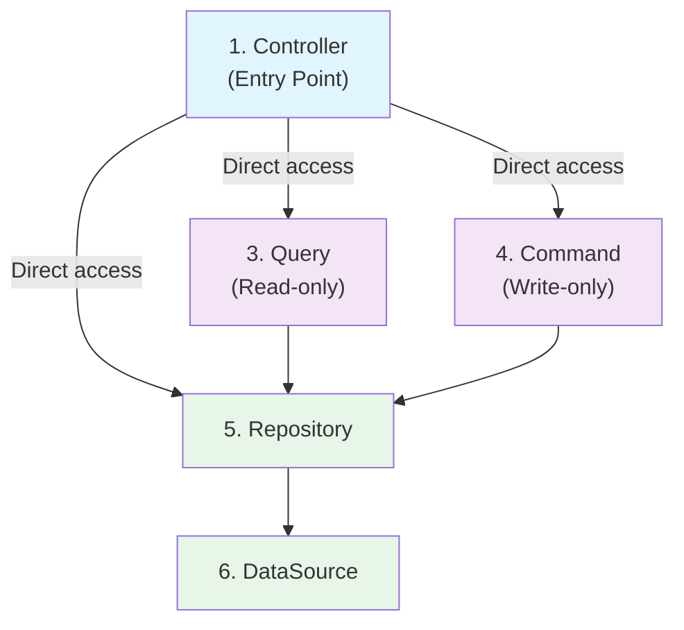

# TodoCoordinator Removal - BE-001 Compliance Refactor

**Status:** planning
**Created:** 2026-03-17
**Approach:** Remove Coordinator - No Orchestration Needed

---

## Executive Summary

The TodoCoordinator violates **BE-001** by existing as a pass-through wrapper with NO orchestration. According to BE-001 line 73:

> "The coordinator's sole purpose is the **orchestration** of commands and queries. It must not be used if no orchestration is needed (e.g., merely wrapping a single command or query)."

**Solution**: Remove TodoCoordinator entirely. Controller will call Query/Command layers directly (as allowed by BE-001 line 72).

---

## The Problem

Current TodoCoordinator methods are just wrappers:

```typescript
// ❌ NO ORCHESTRATION - Just wrapping
getTodos(): TodosList {
  return this.getTodosQuery.execute();  // Direct pass-through
}

getTodoById(id: string): Todo | null {
  try {
    const todoId = TodoId.of(id);
    return this.getTodoByIdQuery.execute(todoId);  // Direct pass-through
  } catch {
    return null;
  }
}

createTodo(createTodoDto: CreateTodoDto): Todo {
  return this.createTodoCommand.execute(  // Direct pass-through
    createTodoDto.title,
    createTodoDto.description,
    createTodoDto.status as TodoStatus | undefined,
  );
}

updateTodo(id: string, updateTodoDto: UpdateTodoDto): Todo | null {
  return this.updateTodoCommand.execute(  // Direct pass-through
    id,
    updateTodoDto.title,
    updateTodoDto.description,
    updateTodoDto.completed,
    updateTodoDto.status as TodoStatus | undefined,
  );
}

getTodosByStatus(status: string): Todo[] {
  return this.todoRepository.findByStatus(status);  // Direct repo access
}
```

**None of these coordinate multiple operations!** This violates BE-001.

### Correct Pattern per BE-001

```typescript
// ✅ ORCHESTRATION - Coordinates multiple operations
async reserve(id: string) {
  const user = await this.userRepository.findById(id);      // Query
  await this.scheduleRepository.reserve(user, 'YYYYMMDD');  // Command
  // Now it's orchestrating!
}
```

TodoCoordinator doesn't do this. It just wraps single operations.

---

## Solution: Remove Coordinator

**BE-001 allows Controller to access Query/Command directly** (line 72):
> "Controller: Entry point. Accesses Coordinator, Query, and Command."

### Files to Delete (1)
- `server/src/todos/coordinator/todo.coordinator.ts`
- `server/src/todos/coordinator/` (entire directory if only file)

### Files to Modify (2)
- `server/src/todos/todo.controller.ts` - Inject Query/Command directly
- `server/src/todos/todo.module.ts` - Remove Coordinator provider

### Files to Update (1)
- `server/src/todos/todo.controller.spec.ts` - Update mocks/tests

---

## Phase 1: Update TodoController

**File**: `server/src/todos/todo.controller.ts`

### Current (with Coordinator)
```typescript
@Controller('todos')
export class TodoController {
  constructor(private readonly coordinator: TodoCoordinator) {}

  @Post()
  createTodo(@Body() createTodoDto: CreateTodoDto): TodoResponseDto {
    try {
      const todo = this.coordinator.createTodo(createTodoDto);
      return this.mapTodoToResponseDto(todo);
    } catch (error) {
      throw new BadRequestException(
        error instanceof Error ? error.message : 'Failed to create todo',
      );
    }
  }

  @Get()
  getTodos(@Query('status') status?: string): TodoResponseDto[] {
    if (status) {
      const todos = this.coordinator.getTodosByStatus(status);
      return todos.map((todo) => this.mapTodoToResponseDto(todo));
    }
    const todosList = this.coordinator.getTodos();
    return todosList.getAll().map((todo) => this.mapTodoToResponseDto(todo));
  }

  @Get(':id')
  getTodoById(@Param('id') id: string): TodoResponseDto {
    const todo = this.coordinator.getTodoById(id);
    if (!todo) {
      throw new NotFoundException(`Todo with id ${id} not found`);
    }
    return this.mapTodoToResponseDto(todo);
  }

  @Patch(':id')
  updateTodo(
    @Param('id') id: string,
    @Body() updateTodoDto: UpdateTodoDto,
  ): TodoResponseDto {
    try {
      const todo = this.coordinator.updateTodo(id, updateTodoDto);
      if (!todo) {
        throw new NotFoundException(`Todo with id ${id} not found`);
      }
      return this.mapTodoToResponseDto(todo);
    } catch (error) {
      throw new BadRequestException(
        error instanceof Error ? error.message : 'Failed to update todo',
      );
    }
  }
}
```

### New (without Coordinator - Direct Query/Command)
```typescript
import {
  Controller,
  Get,
  Post,
  Patch,
  Param,
  Body,
  Query,
  BadRequestException,
  NotFoundException,
} from '@nestjs/common';
import { CreateTodoDto } from '@/todos/dto/create-todo.dto';
import { UpdateTodoDto } from '@/todos/dto/update-todo.dto';
import { TodoResponseDto } from '@/todos/dto/todo.response.dto';
import { GetTodosQuery } from '@/todos/query/get-todos.query';
import { GetTodoByIdQuery } from '@/todos/query/get-todo-by-id.query';
import { CreateTodoCommand } from '@/todos/command/create-todo.command';
import { UpdateTodoCommand } from '@/todos/command/update-todo.command';
import { Todo } from '@/todos/domain/todo';
import { TodoRepository } from '@/todos/repository/todo.repository';

@Controller('todos')
export class TodoController {
  constructor(
    private readonly getTodosQuery: GetTodosQuery,
    private readonly getTodoByIdQuery: GetTodoByIdQuery,
    private readonly createTodoCommand: CreateTodoCommand,
    private readonly updateTodoCommand: UpdateTodoCommand,
    private readonly todoRepository: TodoRepository,
  ) {}

  @Post()
  createTodo(@Body() createTodoDto: CreateTodoDto): TodoResponseDto {
    try {
      const todo = this.createTodoCommand.execute(
        createTodoDto.title,
        createTodoDto.description,
        createTodoDto.status as any,
      );
      return this.mapTodoToResponseDto(todo);
    } catch (error) {
      throw new BadRequestException(
        error instanceof Error ? error.message : 'Failed to create todo',
      );
    }
  }

  @Get()
  getTodos(@Query('status') status?: string): TodoResponseDto[] {
    if (status) {
      const todos = this.todoRepository.findByStatus(status);
      return todos.map((todo) => this.mapTodoToResponseDto(todo));
    }
    const todosList = this.getTodosQuery.execute();
    return todosList.getAll().map((todo) => this.mapTodoToResponseDto(todo));
  }

  @Get(':id')
  getTodoById(@Param('id') id: string): TodoResponseDto {
    try {
      const todo = this.getTodoByIdQuery.execute(TodoId.of(id));
      if (!todo) {
        throw new NotFoundException(`Todo with id ${id} not found`);
      }
      return this.mapTodoToResponseDto(todo);
    } catch (error) {
      if (error instanceof NotFoundException) throw error;
      throw new BadRequestException(
        error instanceof Error ? error.message : 'Invalid todo ID',
      );
    }
  }

  @Patch(':id')
  updateTodo(
    @Param('id') id: string,
    @Body() updateTodoDto: UpdateTodoDto,
  ): TodoResponseDto {
    try {
      const todo = this.updateTodoCommand.execute(
        id,
        updateTodoDto.title,
        updateTodoDto.description,
        updateTodoDto.completed,
        updateTodoDto.status as any,
      );
      if (!todo) {
        throw new NotFoundException(`Todo with id ${id} not found`);
      }
      return this.mapTodoToResponseDto(todo);
    } catch (error) {
      throw new BadRequestException(
        error instanceof Error ? error.message : 'Failed to update todo',
      );
    }
  }

  private mapTodoToResponseDto(todo: Todo): TodoResponseDto {
    return new TodoResponseDto(
      todo.id().value(),
      todo.title().value(),
      todo.description(),
      todo.completed(),
      todo.createdAt(),
      todo.status(),
    );
  }
}
```

**Key Changes**:
- ✅ Inject Query/Command directly (not through Coordinator)
- ✅ Call Query/Command.execute() directly
- ✅ Keep error handling at Controller boundary
- ✅ Repository still available for status filtering (simpler than creating a Query for this)
- ✅ Same behavior, cleaner architecture

---

## Phase 2: Update TodoModule

**File**: `server/src/todos/todo.module.ts`

### Current (with Coordinator)
```typescript
import { Module } from '@nestjs/common';
import { TodoDataSource } from '@/todos/datasource/todo.datasource';
import { TodoRepository } from '@/todos/repository/todo.repository';
import { GetTodosQuery } from '@/todos/query/get-todos.query';
import { GetTodoByIdQuery } from '@/todos/query/get-todo-by-id.query';
import { CreateTodoCommand } from '@/todos/command/create-todo.command';
import { UpdateTodoCommand } from '@/todos/command/update-todo.command';
import { TodoCoordinator } from '@/todos/coordinator/todo.coordinator';
import { TodoController } from '@/todos/todo.controller';

@Module({
  controllers: [TodoController],
  providers: [
    TodoDataSource,
    TodoRepository,
    GetTodosQuery,
    GetTodoByIdQuery,
    CreateTodoCommand,
    UpdateTodoCommand,
    TodoCoordinator,
  ],
})
export class TodoModule {}
```

### New (without Coordinator)
```typescript
import { Module } from '@nestjs/common';
import { TodoDataSource } from '@/todos/datasource/todo.datasource';
import { TodoRepository } from '@/todos/repository/todo.repository';
import { GetTodosQuery } from '@/todos/query/get-todos.query';
import { GetTodoByIdQuery } from '@/todos/query/get-todo-by-id.query';
import { CreateTodoCommand } from '@/todos/command/create-todo.command';
import { UpdateTodoCommand } from '@/todos/command/update-todo.command';
import { TodoController } from '@/todos/todo.controller';

@Module({
  controllers: [TodoController],
  providers: [
    TodoDataSource,
    TodoRepository,
    GetTodosQuery,
    GetTodoByIdQuery,
    CreateTodoCommand,
    UpdateTodoCommand,
    // TodoCoordinator removed - not needed
  ],
})
export class TodoModule {}
```

**Changes**:
- ✅ Remove TodoCoordinator import
- ✅ Remove TodoCoordinator from providers
- ✅ All Query/Command still provided (Controller needs them)

---

## Phase 3: Delete TodoCoordinator

**Files to delete**:
- `server/src/todos/coordinator/todo.coordinator.ts`
- `server/src/todos/coordinator/` directory (if this is the only file)

---

## Phase 4: Update Tests

**File to update**: `server/src/todos/todo.controller.spec.ts`

### Changes in test setup:
```typescript
// BEFORE
const mockCoordinator = {
  createTodo: jest.fn(),
  getTodos: jest.fn(),
  getTodoById: jest.fn(),
  updateTodo: jest.fn(),
  getTodosByStatus: jest.fn(),
};
controller = new TodoController(mockCoordinator);

// AFTER
const mockGetTodosQuery = { execute: jest.fn() };
const mockGetTodoByIdQuery = { execute: jest.fn() };
const mockCreateTodoCommand = { execute: jest.fn() };
const mockUpdateTodoCommand = { execute: jest.fn() };
const mockTodoRepository = { findByStatus: jest.fn() };

controller = new TodoController(
  mockGetTodosQuery,
  mockGetTodoByIdQuery,
  mockCreateTodoCommand,
  mockUpdateTodoCommand,
  mockTodoRepository,
);
```

### Update test expectations:
```typescript
// BEFORE
it('should call coordinator.createTodo', () => {
  mockCoordinator.createTodo.mockReturnValue(mockTodo);
  controller.createTodo(createTodoDto);
  expect(mockCoordinator.createTodo).toHaveBeenCalledWith(createTodoDto);
});

// AFTER
it('should call createTodoCommand.execute', () => {
  mockCreateTodoCommand.execute.mockReturnValue(mockTodo);
  controller.createTodo(createTodoDto);
  expect(mockCreateTodoCommand.execute).toHaveBeenCalledWith(
    createTodoDto.title,
    createTodoDto.description,
    createTodoDto.status,
  );
});
```

---

## Architecture After Refactor



**Key Difference**:
- ❌ BEFORE: Controller → Coordinator → Query/Command
- ✅ AFTER: Controller → Query/Command directly (when no orchestration needed)

---

## Files Changed Summary

| File | Action | Reason |
|------|--------|--------|
| `todo.controller.ts` | MODIFY | Inject Query/Command directly, remove Coordinator |
| `todo.module.ts` | MODIFY | Remove Coordinator provider |
| `coordinator/todo.coordinator.ts` | DELETE | Not needed - no orchestration |
| `coordinator/` (directory) | DELETE | Only file was coordinator.ts |
| `todo.controller.spec.ts` | MODIFY | Update mocks to test Query/Command directly |

**Files NOT changed** (already correct):
- All Query classes
- All Command classes
- All DTO classes
- All Domain classes
- Repository
- DataSource

---

## Implementation Checklist

- [ ] **Phase 1**: Update TodoController
  - [ ] Add Query/Command imports
  - [ ] Update constructor to inject Query/Command/Repository
  - [ ] Update all methods to call Query/Command.execute() directly
  - [ ] Keep error handling at Controller boundary

- [ ] **Phase 2**: Update TodoModule
  - [ ] Remove TodoCoordinator import
  - [ ] Remove TodoCoordinator from providers array

- [ ] **Phase 3**: Delete TodoCoordinator
  - [ ] Delete `coordinator/todo.coordinator.ts`
  - [ ] Delete `coordinator/` directory if empty

- [ ] **Phase 4**: Update Tests
  - [ ] Update test mocks (remove Coordinator, add Query/Command)
  - [ ] Update test expectations
  - [ ] Verify all tests pass

- [ ] **Verification**:
  - [ ] `npm run build` - No TypeScript errors
  - [ ] `npm run lint` - No lint warnings
  - [ ] `npm run test` - All tests pass
  - [ ] Manual API testing - All endpoints work
  - [ ] `curl http://localhost:3000/todos` - GET works
  - [ ] `curl -X POST http://localhost:3000/todos -d '...'` - POST works
  - [ ] `curl http://localhost:3000/todos/123` - GET by ID works
  - [ ] `curl http://localhost:3000/todos?status=todo` - Filter works
  - [ ] `curl -X PATCH http://localhost:3000/todos/123 -d '...'` - PATCH works

---

## Acceptance Criteria

### AC1: BE-001 Compliance
- [ ] Coordinator removed completely
- [ ] Controller calls Query/Command directly (allowed by BE-001)
- [ ] No wrapper layers
- [ ] Proper layer separation maintained
**Verify**: `grep -r "Coordinator" server/src/todos/` returns no results

### AC2: Backward Compatibility
- [ ] All endpoints work identically
- [ ] Same request/response formats
- [ ] Same HTTP status codes
- [ ] Same error handling
**Verify**: All manual API tests pass

### AC3: Code Quality
- [ ] All tests pass
- [ ] No TypeScript errors
- [ ] No lint warnings
- [ ] Code is cleaner (fewer layers for simple CRUD)
**Verify**:
```bash
npm run test
npm run build
npm run lint
```

---

## Benefits of This Approach

✅ **Simpler Architecture** - One less layer for simple operations
✅ **BE-001 Compliant** - Coordinator only orchestrates, doesn't wrap
✅ **Clearer Responsibility** - Controller directly owns API logic
✅ **Better Testability** - Fewer mocks needed
✅ **Same Functionality** - No behavioral changes
✅ **Easier Debugging** - Shorter call stack

---

## Next Steps

1. **Review this revised plan** - Confirm approach is correct
2. **Phase 1**: Update TodoController
3. **Phase 2**: Update TodoModule
4. **Phase 3**: Delete TodoCoordinator
5. **Phase 4**: Update Tests
6. **Verify**: Run tests, build, lint
7. **Commit**: Clear git history
